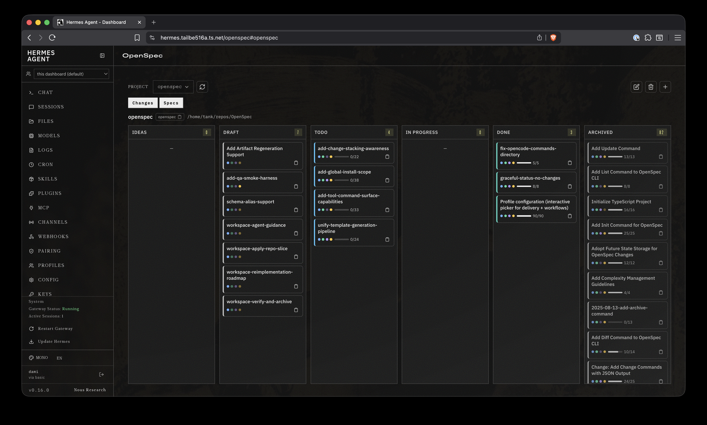
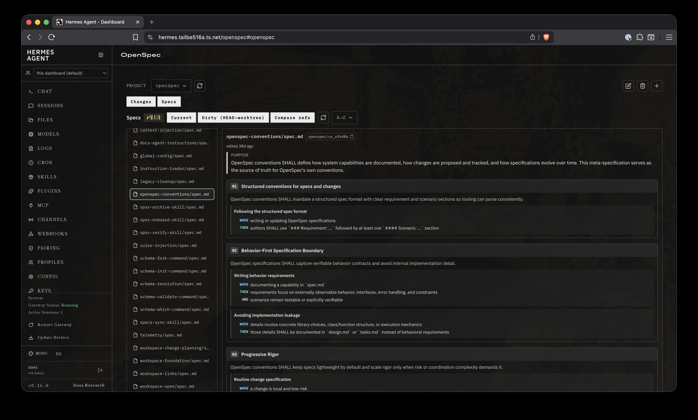

# hermes-openspec

OpenSpec integration plugin for [Hermes Agent](https://github.com/NousResearch/hermes-agent) — spec-driven development tools and a dashboard tab for browsing change proposals, specs, and branch diffs across registered repos.

## Why this exists

OpenSpec keeps spec files (`openspec/changes/`, `openspec/specs/`, `openspec/ideas/`) inside the repo alongside code. But there's no way to browse those specs from the Hermes dashboard, and the agent has no native tools to resolve OpenSpec identifiers or run OpenSpec CLI commands.

This plugin closes both gaps:

- **Agent tools** — tools to resolve OpenSpec identifiers, run OpenSpec CLI workflows, and manage idea lifecycle artifacts without shelling out manually. CLI-backed tools are gated behind the OpenSpec binary's availability; filesystem-backed context/idea tools remain available without the CLI.
- **Dashboard tab** — a `/openspec` tab in the Hermes dashboard where you register repos, drill into change proposals (tasks, designs, specs, deltas), browse current specs, and compare branch diffs — all without leaving the dashboard.

## What you get

**Agent tools** — 15 tools covering the full OpenSpec lifecycle:

| Tool | Does |
|---|---|
| `openspec_context` | Resolve a copyable identifier (`puzzletea`, `puzzletea/os_a1b2c3`) into repo path and change/spec content. Always call this first when the user gives you an `os_` identifier — it returns the `workdir` the other tools need. |
| `openspec_list` | List changes or specs in a project (sorted by recent or name). Call before picking a change or spec to inspect, validate, or coordinate with kanban. |
| `openspec_show` | Show a change or spec as JSON — proposal, tasks, design, spec deltas, requirements, and scenarios. Call to read the full content of a specific change or spec. |
| `openspec_validate` | Validate OpenSpec artifacts (a single target, or all changes/specs). Call after editing specs/proposals/tasks or before completing kanban tasks tied to OpenSpec work. |
| `openspec_status` | Show artifact completion status for a change as JSON (which artifacts exist, which are missing, readiness). Call to turn proposal/task progress into kanban updates. |
| `openspec_instructions` | Return enriched instructions for creating an artifact (proposal, design, tasks, specs) or applying a change. Call before implementing a spec-driven change to get the authoring guide. |
| `openspec_idea_create` | Create a markdown idea under `openspec/ideas/` from a title and raw prompt text. Call to capture a feature idea before it's been scoped or evaluated. |
| `openspec_idea_enrich` | Write or update a structured enrichment report for an existing idea — problem statement, proposed direction, feasibility, T-shirt size, risks, key questions, and next step. Call to evaluate whether an idea is worth promoting. |
| `openspec_idea_promote` | Promote an idea into a new OpenSpec change scaffold with proposal/tasks/spec traceability. Call when an enriched idea is ready to become an actionable change. |
| `openspec_task_list` | List checklist tasks for a change — task ids, text, status, and completion counts. Call before marking tasks done or to see what's left. |
| `openspec_task_set_status` | Set selected task ids in a change to `todo` or `done`. Call to update progress as you complete work items. |
| `openspec_change_create` | Create a draft OpenSpec change scaffold directly from a title/summary (optional tasks and spec placeholder). Call to start a new change without going through the idea pipeline. |
| `openspec_change_promote` | Promote a draft change to `todo` by ensuring tasks and a valid spec placeholder exist. Call when a draft is ready for implementation. |
| `openspec_change_archive` | Archive a completed change, refusing if tasks are incomplete unless `force` is set. Call when a change is done and should be moved out of the active board. |
| `openspec_change_unarchive` | Move an archived change back to the active changes directory. Call to reopen a change that was archived prematurely. |

`openspec_context` and the lifecycle write tools (idea/change/task) are filesystem-backed and always available. `openspec_list`, `openspec_show`, `openspec_validate`, `openspec_status`, and `openspec_instructions` require the `openspec` CLI binary.

**Dashboard tab** (`/openspec`):

- Register repos by path — each gets a vanity name and stable tokens (`name/os_a1b2c3`).
- **Changes view** — Kanban-style board: ideas → draft → todo → in_progress → done → archived. Click any change to read its proposal, tasks, design, and spec deltas. Spec deltas render side-by-side (current vs proposed) with structured requirement/scenario parsing.
- **Specs view** — browse current specs in the worktree, sorted alphabetically or by last git commit date. Compare against HEAD (dirty mode) or arbitrary git refs (before/after).
- **Source initialization** — register a repo before it has an `openspec/` directory, then initialize it from the dashboard. CLI-backed and fallback initialization both normalize the plugin-supported layout: `openspec/changes/`, `openspec/changes/archive/`, `openspec/specs/`, and `openspec/ideas/`.
- Deep-linking via URL hash (`#project-name/token#anchor` — the second `#` selects a tab: proposal, tasks, design, or specs).





## Requirements

- **Hermes Agent** — any recent build that supports the plugin system (`hermes plugins install`).
- **OpenSpec CLI** (optional) — needed for CLI-backed agent tools: list, show, validate, status, and instructions. The dashboard tab and filesystem-backed context/idea tools work without it. Install via `npm install -g @fission-ai/openspec@latest` or set `OPENSPEC_BIN` to the binary path.
- **Git** — used for branch diffs and spec commit-date sorting.

## Quickstart

```bash
# Install the plugin
hermes plugins install FelineStateMachine/hermes-openspec

# Enable it (prompts automatically during install, or run explicitly)
hermes plugins enable openspec
```

Restart Hermes if it's running. The OpenSpec tab appears in the dashboard at `/openspec`.

To register a repo in the dashboard, open the OpenSpec tab and click **Add source**, or use the agent tool:

```
openspec_context(identifier="/path/to/your/repo")
```

The repo doesn't need an `openspec/` directory upfront — if it's missing, the dashboard shows an **Initialize** button that creates the plugin-supported OpenSpec roots. Once initialized, the dashboard shows changes, ideas, and specs live from the filesystem.

## Verify

```bash
# Confirm the plugin is installed and enabled
hermes plugins list --plain

# Check that the openspec binary is found
openspec --version

# In the dashboard, open the OpenSpec tab
# (or curl the API if the dashboard is running on loopback)
curl http://127.0.0.1:9119/api/plugins/openspec/sources
```

If `openspec` isn't on your PATH, set `OPENSPEC_BIN`:

```bash
export OPENSPEC_BIN=/home/user/.npm-global/bin/openspec
```

## Update

```bash
hermes plugins update openspec
```

This pulls the latest from the remote and reloads. If the backend API routes changed (`plugin_api.py`), restart Hermes to remount them — the dashboard rescan (`/api/dashboard/plugins/rescan`) reloads frontend assets but does not remount backend routes.

## Documentation map

```
hermes-openspec/
├── plugin.yaml              # Tool plugin manifest — declares agent tools
├── __init__.py              # Plugin registration — wires tools, sets check_fn gating
├── schemas.py               # Tool parameter schemas (JSON Schema for each tool)
├── tools.py                 # Tool handlers — wraps OpenSpec CLI and filesystem-backed idea workflows
├── registry.py              # SQLite registry of sources at <hermes_home>/openspec.db
├── dashboard/
│   ├── manifest.json        # Dashboard tab manifest — tab path, position, entry/css/api
│   ├── plugin_api.py        # FastAPI router mounted at /api/plugins/openspec/
│   └── dist/
│       ├── index.js         # Dashboard tab frontend (IIFE, uses Hermes plugin SDK)
│       └── style.css        # Plugin styles (uses dashboard --color-* tokens)
```

| File | What to read it for |
|---|---|
| `plugin.yaml` | Which tools the plugin provides |
| `tools.py` | Tool handlers for CLI-backed commands and filesystem-backed idea workflows |
| `registry.py` | Source registry schema, token derivation, DB path |
| `dashboard/plugin_api.py` | All backend API routes and the spec-browser logic |
| `dashboard/manifest.json` | Tab registration, entry points |
| `dashboard/dist/index.js` | Frontend: board, specs view, source dialogs, deep-linking |
