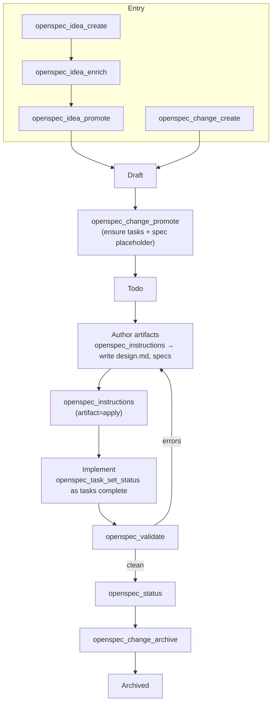
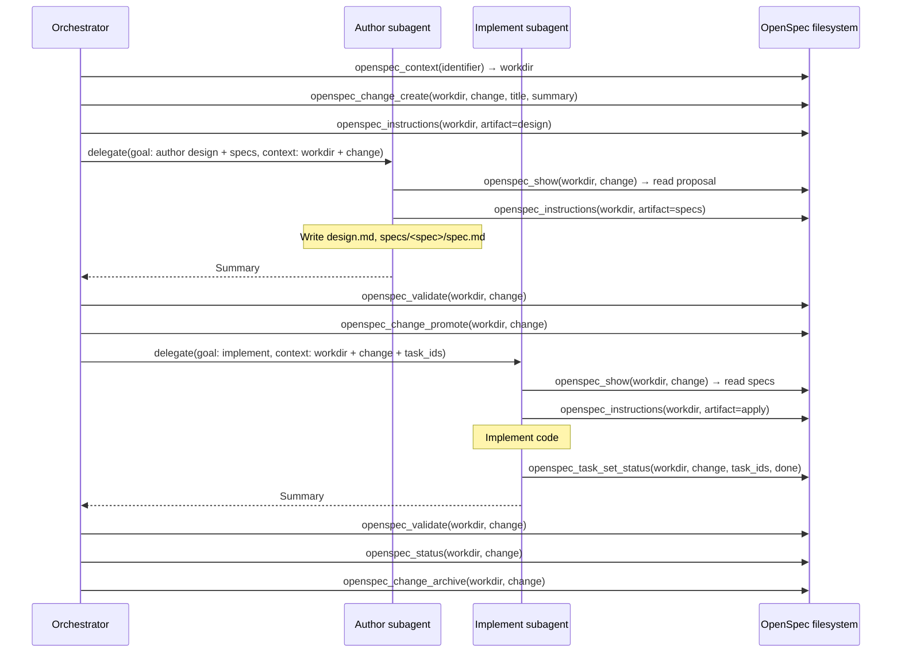
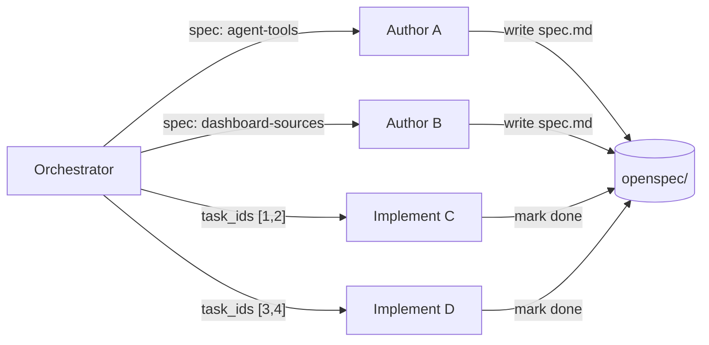

# Delegation

How to run a change end-to-end and delegate authoring and implementation work
to subagents.

## Full workflow

Two entry paths (idea pipeline or direct creation) converge at Draft, then
follow the same path to archive. Authoring (design + specs) can be done by
the orchestrator or delegated.

Authoring and implementation are both delegatable (see below). The validation
loop returns to authoring, not implementation — if specs are wrong, the spec
needs fixing, not just the code.

## Orchestration with subagent delegation

The orchestrator owns the lifecycle: context resolution, change creation,
promotion, validation, and archival. Subagents own authoring and/or
implementation: they receive a change + scope, read the specs, write files or
code, and mark tasks done.

Two delegation patterns:

| Pattern | Subagent does | Orchestrator does after |
|---|---|---|
| **Author** | Writes design.md / spec.md / tasks.md | Reviews, then promotes |
| **Implement** | Writes code, marks task checkboxes | Validates, then archives |

### Delegation contract

The handoff is the same for both patterns — only the goal differs:

| Field | Value | Why the subagent needs it |
|---|---|---|
| `workdir` | Absolute path to the repo | Required by every `openspec_*` tool |
| `change` | Change id (kebab-case) | Identifies which change to read and update |
| `task_ids` | List of task ids from `openspec_task_list` | Which tasks the subagent owns (implement only) |
| `goal` | What to author or implement | The actual work — should reference spec sections |

### Sequence: orchestrator with delegated authoring + implementation

### Subagent rules

The subagent should:
1. Call `openspec_show(workdir, change)` to read the proposal, design, and specs.
2. Call `openspec_instructions(workdir, artifact=...)` for the relevant guide.
3. Do the work (write artifacts or implement code).
4. If implementing: call `openspec_task_set_status(workdir, change, task_ids=..., status=done)` for completed tasks.
5. Return a summary of what was done.

The subagent should **not** create, promote, archive, or unarchive changes —
that's the orchestrator's job. This keeps lifecycle ownership in one place and
prevents race conditions when multiple subagents work on the same change.

## Parallel delegation

When a change has independent task groups, the orchestrator can delegate them
in parallel. This works for both authoring (different specs) and
implementation (different code areas):

Each subagent writes to its own files (spec authoring) or marks only its own
task ids (implementation). Because spec paths and task ids are unique, there
are no write conflicts. The orchestrator runs `openspec_validate` and
`openspec_status` after all subagents return to confirm everything is done
before promoting or archiving.

---

← [Back to overview](orchestration.md) · [← Previous: Tool reference](tool-reference.md)
