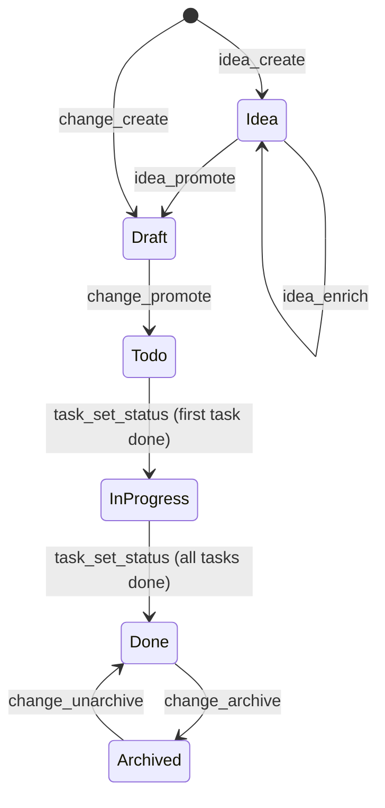
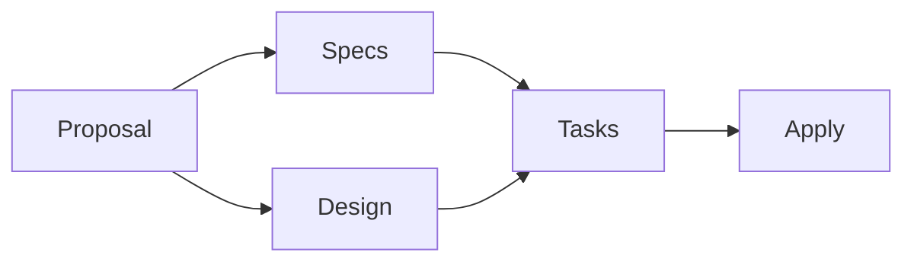

# Change Lifecycle

Every change moves through the same states. States are derived from task
checkboxes in `tasks.md` — there is no explicit state field.

| State | Meaning | Where it lives |
|---|---|---|
| Idea | Raw or enriched idea, not yet a change | `openspec/ideas/<slug>.md` |
| Draft | Change scaffold exists but lacks tasks or spec placeholder | `openspec/changes/<change>/` |
| Todo | Tasks and spec placeholder exist — ready to implement | `openspec/changes/<change>/` |
| In progress | At least one task done, at least one remaining | `openspec/changes/<change>/` |
| Done | All tasks done | `openspec/changes/<change>/` |
| Archived | Completed, moved out of active board | `openspec/changes/archive/<change>/` |

## Artifact readiness

OpenSpec derives readiness from artifact dependencies. `openspec_status`
surfaces this so you know when a change is safe to promote or archive.

- **Proposal** is always required. A change without it is invalid.
- **Specs** define what the change does — required before tasks make sense.
- **Design** explains how — optional for small changes, required for
  non-trivial ones.
- **Tasks** break the implementation into checklist items.
- **Apply** is the implementation guide returned by
  `openspec_instructions(artifact=apply)` — what a subagent follows to write
  the code.

`openspec_change_promote` requires tasks + spec placeholder. It does not
require design — that's a judgment call for the orchestrator.

---

← [Back to overview](index.md) · [Next: Tool reference →](tool-reference.md)
