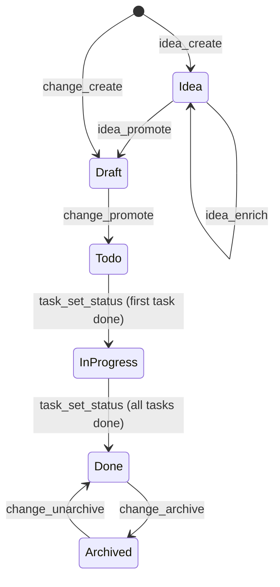
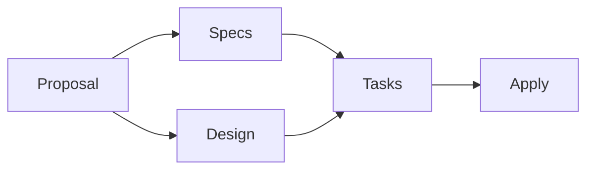
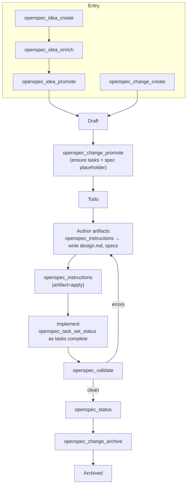
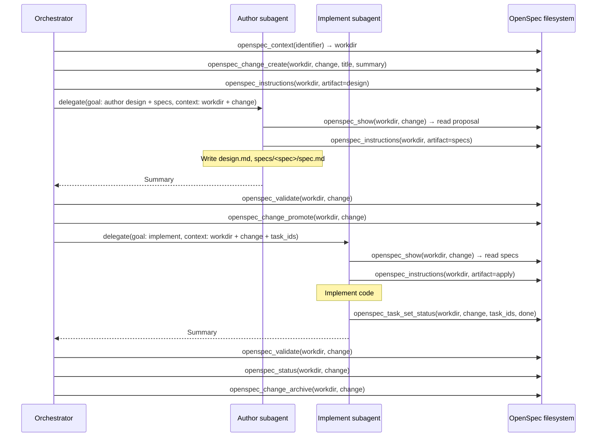
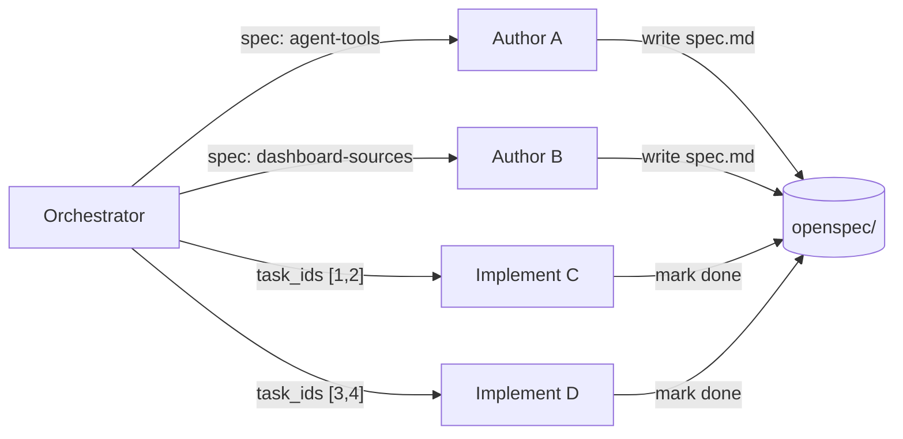

# Orchestration Pattern

This document describes the repeatable workflow for driving an OpenSpec change
from idea to archive, including how to delegate authoring and implementation
work to subagents.

It's written for two audiences:

- **Hermes-native** — you know the agent tools but not the OpenSpec artifact
  model. Start with [Tool → filesystem effect](#tool--filesystem-effect).
- **OpenSpec-native** — you know the lifecycle (idea → change → specs →
  archive) but not which Hermes tool does what. Start with
  [Artifact → tool mapping](#artifact--tool-mapping).

Both perspectives describe the same system. The [full workflow](#full-workflow)
and [delegation](#orchestration-with-subagent-delegation) sections apply to
both.

---

## Change lifecycle

Every change moves through the same states. States are derived from task
checkboxes in `tasks.md` — there is no explicit state field.

| State | Meaning | Where it lives |
|---|---|---|
| Idea | Raw or enriched idea, not yet a change | `openspec/ideas/<slug>.md` |
| Draft | Change scaffold exists but lacks tasks or spec placeholder | `openspec/changes/<change>/` |
| Todo | Tasks and spec placeholder exist — ready to implement | `openspec/changes/<change>/` |
| In progress | At least one task done, at least one remaining | `openspec/changes/<change>/` |
| Done | All tasks done | `openspec/changes/<change>/` |
| Archived | Completed, moved out of active board | `openspec/changes/archive/<change>/` |

---

## Artifact → tool mapping

If you already know OpenSpec's artifact model (proposal, design, tasks, specs,
ideas, archive), this table maps each artifact operation to the Hermes tool
that performs it.

| You want to… | OpenSpec artifact | Hermes tool | Effect |
|---|---|---|---|
| Capture a raw idea | `openspec/ideas/<slug>.md` (new) | `openspec_idea_create` | Writes the idea file |
| Add a structured evaluation to an idea | `openspec/ideas/<slug>.md` (update) | `openspec_idea_enrich` | Appends problem, direction, feasibility, T-shirt size, risks, questions, next step |
| Turn an idea into a change | `openspec/changes/<change>/` (new) | `openspec_idea_promote` | Creates the change scaffold with proposal/tasks/spec traceability |
| Create a change without an idea | `openspec/changes/<change>/` (new) | `openspec_change_create` | Creates the change scaffold directly |
| Author the proposal | `openspec/changes/<change>/proposal.md` | `openspec_instructions` → write file | Returns the authoring guide; you write the file |
| Author the design doc | `openspec/changes/<change>/design.md` | `openspec_instructions` → write file | Returns the authoring guide; you write the file |
| Author specs | `openspec/changes/<change>/specs/<spec>/spec.md` | `openspec_instructions` → write file | Returns the authoring guide; you write the file |
| Author tasks | `openspec/changes/<change>/tasks.md` | `openspec_instructions` → write file | Returns the authoring guide; you write the file |
| Mark a change ready to implement | `tasks.md` + `specs/` placeholder | `openspec_change_promote` | Ensures checklist items and spec placeholder exist |
| Read a change or spec | Any artifact | `openspec_show` | Returns JSON: proposal, tasks, design, specs, deltas |
| Get the implementation guide | `openspec apply` instructions | `openspec_instructions` (artifact=`apply`) | Returns step-by-step apply instructions |
| Track task progress | `tasks.md` checkboxes | `openspec_task_set_status` | Toggles `- [ ]` ↔ `- [x]` |
| Check what artifacts exist | Change directory | `openspec_status` | Returns which artifacts are present/missing and readiness |
| Validate before archiving | All artifacts | `openspec_validate` | Returns validation errors |
| Archive a completed change | `openspec/changes/archive/` | `openspec_change_archive` | Moves the change dir to archive |
| Reopen an archived change | `openspec/changes/` (restore) | `openspec_change_unarchive` | Moves the change dir back to active |

### Artifact readiness

OpenSpec derives readiness from artifact dependencies. `openspec_status`
surfaces this so you know when a change is safe to promote or archive.

- **Proposal** is always required. A change without it is invalid.
- **Specs** define what the change does — required before tasks make sense.
- **Design** explains how — optional for small changes, required for
  non-trivial ones.
- **Tasks** break the implementation into checklist items.
- **Apply** is the implementation guide returned by
  `openspec_instructions(artifact=apply)` — what a subagent follows to write
  the code.

`openspec_change_promote` requires tasks + spec placeholder. It does not
require design — that's a judgment call for the orchestrator.

---

## Tool → filesystem effect

If you know the Hermes tools but want the exact filesystem mutation, this is
the reference.

### Write tools

| Tool | Filesystem effect | Lifecycle transition |
|---|---|---|
| `openspec_idea_create` | Creates `openspec/ideas/<slug>.md` | → Idea |
| `openspec_idea_enrich` | Updates `openspec/ideas/<slug>.md` with structured report | Idea (stays) |
| `openspec_idea_promote` | Creates `openspec/changes/<change>/` (proposal, tasks, specs) | Idea → Draft |
| `openspec_change_create` | Creates `openspec/changes/<change>/` (proposal, tasks, specs) | → Draft |
| `openspec_change_promote` | Ensures `tasks.md` has checklist items + `specs/` has placeholder | Draft → Todo |
| `openspec_task_set_status` | Toggles checkboxes in `openspec/changes/<change>/tasks.md` | Todo → In progress → Done |
| `openspec_change_archive` | Moves `openspec/changes/<change>/` → `openspec/changes/archive/<change>/` | Done → Archived |
| `openspec_change_unarchive` | Moves archive dir back to active changes | Archived → Done |

### Read tools

| Tool | Returns | When to call |
|---|---|---|
| `openspec_context` | Repo path + change/spec content (resolves `os_*` identifiers) | First — gives you the `workdir` for all other tools |
| `openspec_list` | Changes or specs in a project | Before picking a change to work on |
| `openspec_show` | Full change or spec as JSON | To read proposal/tasks/design/specs/deltas |
| `openspec_status` | Artifact completion status (what exists, what's missing) | Before promoting or archiving |
| `openspec_instructions` | Authoring guide for an artifact (proposal, design, tasks, specs, apply) | Before authoring or implementing |
| `openspec_validate` | Validation errors for changes/specs | After editing, before archiving |
| `openspec_task_list` | Task ids, text, status, completion counts | Before marking tasks done |

> **Authoring note:** `openspec_instructions` returns the guide, not the
> artifact. After calling it, the caller writes the file (proposal.md,
> design.md, spec.md, tasks.md) using normal file tools. This is by design —
> the guide is reusable, the content is human/agent judgment.

---

## Full workflow

Two entry paths (idea pipeline or direct creation) converge at Draft, then
follow the same path to archive. Authoring (design + specs) can be done by
the orchestrator or delegated.

Authoring and implementation are both delegatable (see below). The validation
loop returns to authoring, not implementation — if specs are wrong, the spec
needs fixing, not just the code.

---

## Orchestration with subagent delegation

The orchestrator owns the lifecycle: context resolution, change creation,
promotion, validation, and archival. Subagents own authoring and/or
implementation: they receive a change + scope, read the specs, write files or
code, and mark tasks done.

Two delegation patterns:

| Pattern | Subagent does | Orchator does after |
|---|---|---|
| **Author** | Writes design.md / spec.md / tasks.md | Reviews, then promotes |
| **Implement** | Writes code, marks task checkboxes | Validates, then archives |

### Delegation contract

The handoff is the same for both patterns — only the goal differs:

| Field | Value | Why the subagent needs it |
|---|---|---|
| `workdir` | Absolute path to the repo | Required by every `openspec_*` tool |
| `change` | Change id (kebab-case) | Identifies which change to read and update |
| `task_ids` | List of task ids from `openspec_task_list` | Which tasks the subagent owns (implement only) |
| `goal` | What to author or implement | The actual work — should reference spec sections |

### Sequence: orchestrator with delegated authoring + implementation

### Subagent rules

The subagent should:
1. Call `openspec_show(workdir, change)` to read the proposal, design, and specs.
2. Call `openspec_instructions(workdir, artifact=...)` for the relevant guide.
3. Do the work (write artifacts or implement code).
4. If implementing: call `openspec_task_set_status(workdir, change, task_ids=..., status=done)` for completed tasks.
5. Return a summary of what was done.

The subagent should **not** create, promote, archive, or unarchive changes —
that's the orchestrator's job. This keeps lifecycle ownership in one place and
prevents race conditions when multiple subagents work on the same change.

### Parallel delegation

When a change has independent task groups, the orchestrator can delegate them
in parallel. This works for both authoring (different specs) and
implementation (different code areas):

Each subagent writes to its own files (spec authoring) or marks only its own
task ids (implementation). Because spec paths and task ids are unique, there
are no write conflicts. The orchestrator runs `openspec_validate` and
`openspec_status` after all subagents return to confirm everything is done
before promoting or archiving.
